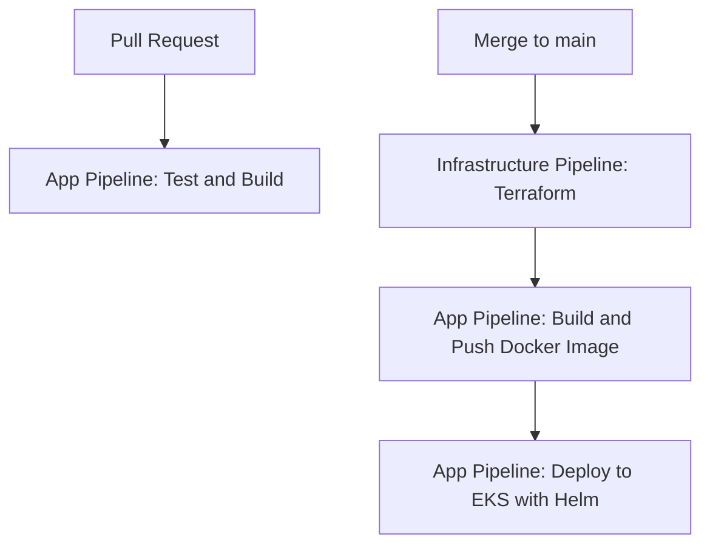

# Cloud & DevOps Final Project

## Overview
This project implements a complete, production-grade CI/CD solution for deploying a containerized Python application on AWS EKS, using Terraform, Helm, and GitHub Actions. The solution is secure, modular, and follows best practices for cloud-native deployments.

---

## Architecture and Key Components

- **VPC** with public and private subnets.
- **EC2 Runner** in a private subnet, with internet access through a NAT Gateway. This runner is essential for running GitHub Actions pipelines in a private network and accessing GitHub secrets for infrastructure provisioning with Terraform.
- **EKS Cluster** in private subnets.
- **Application Load Balancer (ALB)** in a public subnet, routing external traffic to app pods in private subnets.
- **AWS Load Balancer Controller** automatically installed from the infrastructure pipeline.
- **GitHub Actions** for CI/CD, using the self-hosted runner in the VPC for private access to the EKS API and Terraform execution.

**Important:** The EKS module now explicitly depends on the EC2 runner (`depends_on`), ensuring the runner is available before creating the EKS cluster and resources.

---

## Infrastructure Creation Flow

1. **VPC and subnets:** 2 public and 2 private subnets are created, with route tables and a NAT Gateway for internet access from the private subnets.
2. **EC2 Runner:** Launched in the first private subnet. Thanks to the NAT Gateway, it can access the internet (GitHub, updates, etc.) without being publicly exposed.
3. **EKS Cluster:** Created in private subnets, ensuring nodes are not accessible from the internet.
4. **ALB:** The Kubernetes Ingress creates an ALB in the public subnet, securely exposing the app.

The creation order is guaranteed by the explicit dependency (`depends_on`) between modules.

---

## Visual Flow Summary

```mermaid
flowchart TD
    A[VPC and Subnets] --> B[EC2 Runner (private subnet, internet access via NAT GW)]
    B --> C[EKS Cluster (private subnet)]
    C --> D[ALB (public subnet, Ingress)]
    D --> E[Users access the app]
```

---

## Notes on the EC2 Runner and NAT Gateway

- The EC2 runner is essential for running GitHub Actions pipelines in a private network and accessing GitHub secrets.
- It does not have a public IP, but can access the internet thanks to the NAT Gateway.
- It allows Terraform and Helm to run securely and privately, meeting security and architecture requirements.

---

## Repository Structure

```
.
├── app/                # Python FastAPI/Flask app
├── terraform/          # Infrastructure as Code (EKS, VPC, etc.)
├── helm/               # Helm chart for Kubernetes deployment
└── .github/workflows/  # CI/CD pipelines
```

---

## Prerequisites

- AWS account with permissions for EKS, EC2, S3, DynamoDB, IAM, ECR.
- Docker and AWS CLI installed locally (for manual steps).
- GitHub repository with Actions enabled.
- Self-hosted runner in a private subnet for EKS deploys (see below).

---

## Infrastructure and Deployment

1. **Configure AWS credentials** in GitHub Secrets (`AWS_ACCESS_KEY_ID`, `AWS_SECRET_ACCESS_KEY`, `API_KEY`, `PAT`).
2. **Deploy the infrastructure and the controller automatically:**
   - The infrastructure pipeline creates the VPC, subnets, EKS, roles, S3, DynamoDB, etc.
   - The `install-alb-controller` job installs the AWS Load Balancer Controller in the EKS cluster, allowing Kubernetes Ingress to create and manage a public ALB.
3. **Deploy the application:**
   - The application pipeline builds the image, pushes it to ECR, and deploys it to EKS using Helm.
   - The app's Ingress is configured to use the ALB, which routes external traffic to the private pods.

---

## Application Setup

1. **Build and test locally:**
   ```bash
   cd app
   pip install -r requirements.txt
   pytest
   ```

2. **Build and push Docker image:**
   ```bash
   docker build -t <your-ecr-repo>:latest .
   docker push <your-ecr-repo>:latest
   ```

3. **Deploy to EKS using Helm:**
   ```bash
   helm upgrade --install fastapi-app ./helm/fastapi-app \
     --namespace production --create-namespace \
     --set image.repository=<your-ecr-repo> \
     --set image.tag=latest --wait
   ```

---

## CI/CD Workflow Overview

### 1. Pull Request (PR)
- Only the `test-and-build` job from `app-pipeline.yml` runs.
- This job checks out the code, installs dependencies, and runs tests.
- **No image is built or pushed, and no deployment or infrastructure changes are made.**

### 2. Merge to `main` (push to main)
- **Step 1: Infrastructure Pipeline**
  - The `infrastructure-pipeline.yml` workflow runs on every push to `main`.
  - It provisions or updates all AWS infrastructure (EKS cluster, VPC, subnets, IAM roles, etc.) using Terraform.
  - **No application is deployed at this stage.**
- **Step 2: Application Pipeline**
  - When the infrastructure pipeline completes successfully, the `app-pipeline.yml` workflow is triggered automatically (via `workflow_run`).
  - It builds and pushes the Docker image to ECR.
  - Then, it deploys the application to the EKS cluster using Helm.

### Visual Summary



### Key Points
- The application is never deployed and the infrastructure is never changed on PRs.
- The deployment of the app only happens if the infrastructure was created/updated successfully.
- The order is always: **infrastructure first, then application deployment**.

---

## Accessing the Application

- **Public URL:**
  - The Application Load Balancer (ALB) is the only public entry point. Find the ALB DNS in the AWS console.
- **Health check:**
  - `curl http://<alb-dns>/health`
- **API endpoint:**
  - `curl http://<alb-dns>/api`

---

## Security and Best Practices

- All secrets are managed with GitHub Secrets.
- The EKS API is private; deployments use a self-hosted runner in the VPC.
- The ALB is public, but pods and nodes are in private subnets.
- Infrastructure is scanned with tfsec and tflint.
- IAM with least privilege.
- The AWS Load Balancer Controller is installed automatically from the pipeline.

---

## Example Pipeline Logs

- (Add screenshots or links to successful pipeline runs)

---

## Extras

- Helm, tfsec, tflint, etc. used for best practices.
- Branching and PR strategy documented in CONTRIBUTING.md.

---

## Want to contribute ?

If you want to contribute to this project, please check the contribution guide at [docs/CONTRIBUTING.md](docs/CONTRIBUTING.md) to learn about the rules, workflow, and best practices.

---

## License

MIT 