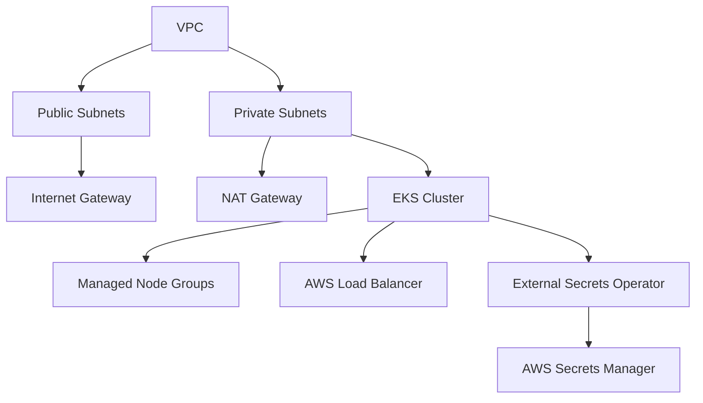

# Cloud & DevOps Final Project

## Overview
This project implements a modular and secure CI/CD solution to deploy a Python application on AWS EKS using Terraform, Helm, and GitHub Actions. The architecture follows security and automation best practices.

---

## Architecture and Key Components

- **VPC and Networking**: 
  - Public and private subnets
  - Internet Gateway and NAT Gateway
  - Route tables and security groups
- **EKS Cluster**:
  - Managed node groups in private subnets
  - OIDC provider for IAM roles
  - AWS Load Balancer Controller
- **Secrets Management**:
  - AWS Secrets Manager for API keys
  - External Secrets Operator in EKS
- **CI/CD Pipeline**:
  - GitHub Actions for automation
  - ECR for container registry
  - Helm for Kubernetes deployments

---

## Infrastructure Creation Flow

1. **VPC Setup**:
   - Create VPC with public/private subnets
   - Configure Internet Gateway and NAT Gateway
   - Set up route tables and security groups

2. **EKS Deployment**:
   - Create EKS cluster in private subnets
   - Deploy managed node groups
   - Configure OIDC provider
   - Install AWS Load Balancer Controller

3. **Application Layer**:
   - Deploy External Secrets Operator
   - Configure Secrets Manager
   - Deploy application using Helm

---

## Visual Summary



---

## Repository Structure

```
.
├── app/
│   ├── Dockerfile
│   ├── main.py
│   ├── requirements.txt
│   └── tests/
├── terraform/
│   ├── main.tf
│   ├── variables.tf
│   ├── outputs.tf
│   ├── providers.tf
│   └── modules/
│       ├── vpc/
│       ├── eks/
│       └── ec2/
├── helm/
│   └── fastapi-app/
│       ├── Chart.yaml
│       ├── values.yaml
│       └── templates/
└── .github/
    └── workflows/
        └── deploy.yml
```

---

## Prerequisites

- AWS CLI configured
- Terraform >= 1.5.0
- kubectl
- helm
- GitHub repository with Actions enabled
- Required AWS permissions

---

## Setup and Deployment

### 1. Infrastructure Deployment
```bash
cd terraform
terraform init
terraform plan
terraform apply
```

### 2. Configure kubectl
```bash
aws eks update-kubeconfig --region us-east-1 --name cluster-name
```

### 3. Deploy Application
```bash
cd helm/fastapi-app
helm upgrade --install fastapi-app . -f values.yaml
```

---

## CI/CD Pipeline

The GitHub Actions workflow includes:

1. **Build Phase**:
   - Run tests
   - Build Docker image
   - Push to ECR

2. **Deploy Phase**:
   - Update Helm values
   - Deploy to EKS
   - Verify deployment

---

## Implemented Best Practices

- Infrastructure as Code (IaC) with Terraform
- Modular and reusable code structure
- Secure secrets management
- Private networking for EKS nodes
- Automated CI/CD pipeline
- Clear documentation and architecture diagrams

---

## Testing and Verification

- [ ] AWS resources created successfully
- [ ] Application accessible via Load Balancer
- [ ] Secrets properly managed
- [ ] CI/CD pipeline working
- [ ] Monitoring and logging configured

---

## Additional Notes

- All infrastructure is managed through Terraform
- Secrets are handled securely via AWS Secrets Manager
- Load Balancer automatically provisions for ingress resources
- Node groups scale based on demand

---

## Runner and Automation

All Terraform operations are executed from a dedicated EC2 instance (runner) deployed in a public subnet. This runner is registered as a self-hosted runner for GitHub Actions, enabling secure and automated execution of infrastructure code. The runner has network access to AWS and GitHub, allowing it to:
- Run Terraform commands for infrastructure provisioning
- Automate the creation and management of secrets in AWS Secrets Manager
- Trigger deployments and updates via GitHub Actions workflows

Additionally, the entire lifecycle of the EKS cluster (creation, updates, and deletion) is managed from this runner, ensuring centralized and secure control over all infrastructure resources.

---

For details about the contribution process and CI/CD workflow, please refer to [CONTRIBUTING.md](docs/CONTRIBUTING.md).

---
