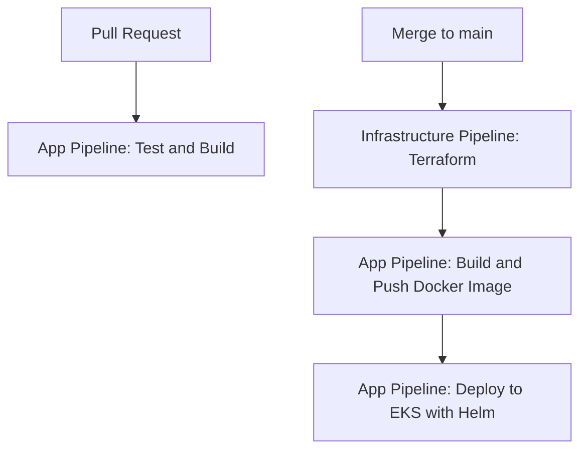

# Cloud & DevOps Final Project

## Overview
This project implements a complete, production-grade CI/CD solution for deploying a containerized Python application on AWS EKS, using Terraform, Helm, and GitHub Actions. The solution is secure, modular, and follows best practices for cloud-native deployments.

---

## Arquitectura y Componentes Clave

- **VPC** con subredes públicas y privadas.
- **EKS Cluster** en subredes privadas.
- **Application Load Balancer (ALB)** en subred pública, enruta tráfico externo a los pods de la app en privadas.
- **AWS Load Balancer Controller** instalado automáticamente desde el pipeline de infraestructura (no requiere instalación manual en el runner).
- **GitHub Actions** para CI/CD, con un runner self-hosted en la VPC solo para acceso privado al API de EKS (no para exponer el ALB).

---

## Repository Structure

```
.
├── app/                # Python FastAPI/Flask app
├── terraform/          # Infrastructure as Code (EKS, VPC, etc.)
├── helm/               # Helm chart for Kubernetes deployment
└── .github/workflows/  # CI/CD pipelines
```

---

## Prerequisites

- AWS account with permissions for EKS, EC2, S3, DynamoDB, IAM, ECR.
- Docker and AWS CLI installed locally (for manual steps).
- GitHub repository with Actions enabled.
- Self-hosted runner in a private subnet for EKS deploys (see below).

---

## Infraestructura y Despliegue

1. **Configura las credenciales de AWS** en GitHub Secrets (`AWS_ACCESS_KEY_ID`, `AWS_SECRET_ACCESS_KEY`, `API_KEY`).
2. **Despliega la infraestructura y el controller automáticamente:**
   - El pipeline de infraestructura crea la VPC, subredes, EKS, roles, S3, DynamoDB, etc.
   - El job `install-alb-controller` instala el AWS Load Balancer Controller en el clúster EKS, permitiendo que los Ingress de Kubernetes creen y gestionen un ALB público.
3. **Despliega la aplicación:**
   - El pipeline de aplicación construye la imagen, la sube a ECR y la despliega a EKS usando Helm.
   - El Ingress de la app está configurado para usar el ALB, que enruta tráfico externo a los pods privados.

---

## Application Setup

1. **Build and test locally:**
   ```bash
   cd app
   pip install -r requirements.txt
   pytest
   ```

2. **Build and push Docker image:**
   ```bash
   docker build -t <your-ecr-repo>:latest .
   docker push <your-ecr-repo>:latest
   ```

3. **Deploy to EKS using Helm:**
   ```bash
   helm upgrade --install fastapi-app ./helm/fastapi-app \
     --namespace production --create-namespace \
     --set image.repository=<your-ecr-repo> \
     --set image.tag=latest --wait
   ```

---

## CI/CD Workflow Overview

### 1. Pull Request (PR)
- Only the `test-and-build` job from `app-pipeline.yml` runs.
- This job checks out the code, installs dependencies, and runs tests.
- **No image is built or pushed, and no deployment or infrastructure changes are made.**

### 2. Merge to `main` (push to main)
- **Step 1: Infrastructure Pipeline**
  - The `infrastructure-pipeline.yml` workflow runs on every push to `main`.
  - It provisions or updates all AWS infrastructure (EKS cluster, VPC, subnets, IAM roles, etc.) using Terraform.
  - **No application is deployed at this stage.**
- **Step 2: Application Pipeline**
  - When the infrastructure pipeline completes successfully, the `app-pipeline.yml` workflow is triggered automatically (via `workflow_run`).
  - It builds and pushes the Docker image to ECR.
  - Then, it deploys the application to the EKS cluster using Helm.

### Visual Summary



### Key Points
- The application is never deployed and the infrastructure is never changed on PRs.
- The deployment of the app only happens if the infrastructure was created/updated successfully.
- The order is always: **infrastructure first, then application deployment**.

---

## Notas sobre el Runner Self-hosted

- El runner self-hosted se usa únicamente para acceder al API privado de EKS y ejecutar despliegues.
- **No es necesario instalar manualmente el AWS Load Balancer Controller en el runner:** el pipeline lo instala automáticamente en el clúster.
- El ALB es gestionado por el controller y expone la app de forma segura.

---

## Accessing the Application

- **URL pública:**
  - El Application Load Balancer (ALB) es el único punto de entrada público. Encuentra el DNS del ALB en la consola de AWS.
- **Health check:**
  - `curl http://<alb-dns>/health`
- **API endpoint:**
  - `curl http://<alb-dns>/api`

---

## Security and Best Practices

- Todos los secretos se gestionan con GitHub Secrets.
- El API de EKS es privado; los despliegues usan un runner self-hosted en la VPC.
- El ALB es público, pero los pods y nodos están en subredes privadas.
- Infraestructura escaneada con tfsec y tflint.
- IAM con privilegios mínimos.
- El AWS Load Balancer Controller se instala automáticamente desde el pipeline.

---

## Example Pipeline Logs

- (Add screenshots or links to successful pipeline runs)

---

## Extras

- Helm, tfsec, tflint, etc. used for best practices.
- Branching and PR strategy documented in CONTRIBUTING.md.

---

## ¿Quieres contribuir?

Si deseas contribuir a este proyecto, por favor revisa la guía de contribución en [docs/CONTRIBUTING.md](docs/CONTRIBUTING.md) para conocer las normas, el flujo de trabajo y las mejores prácticas.

---

## License

MIT 